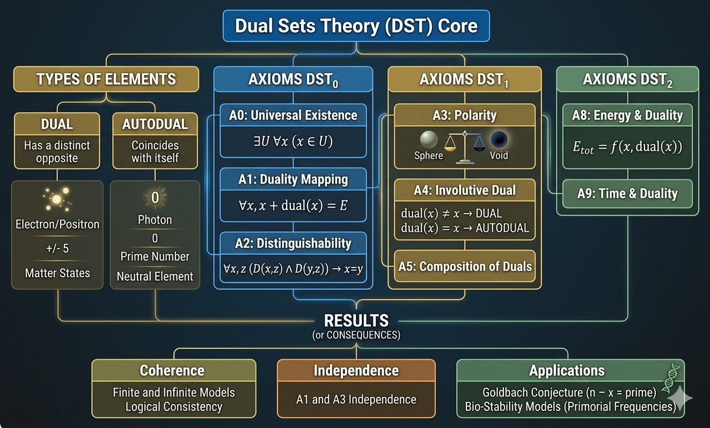
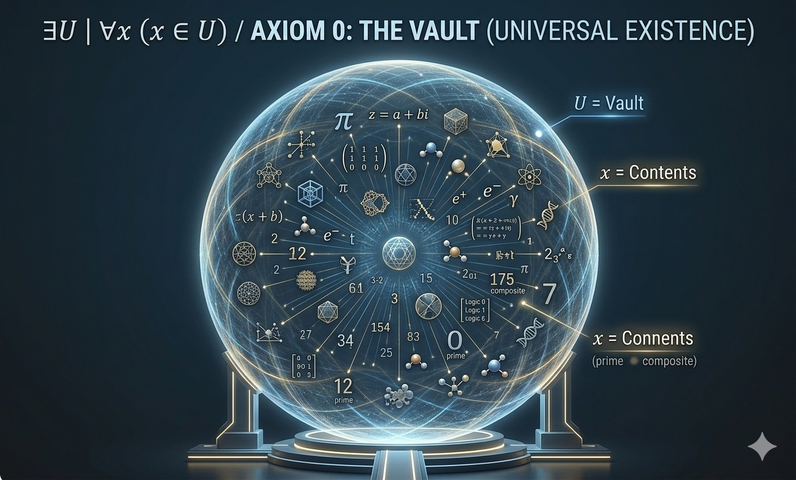
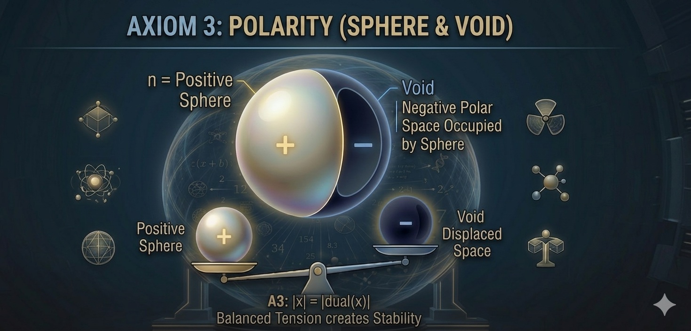
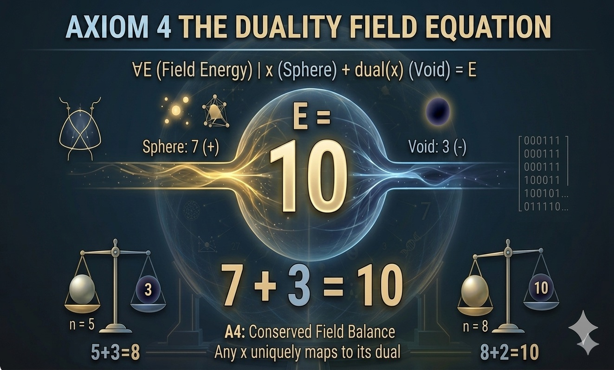
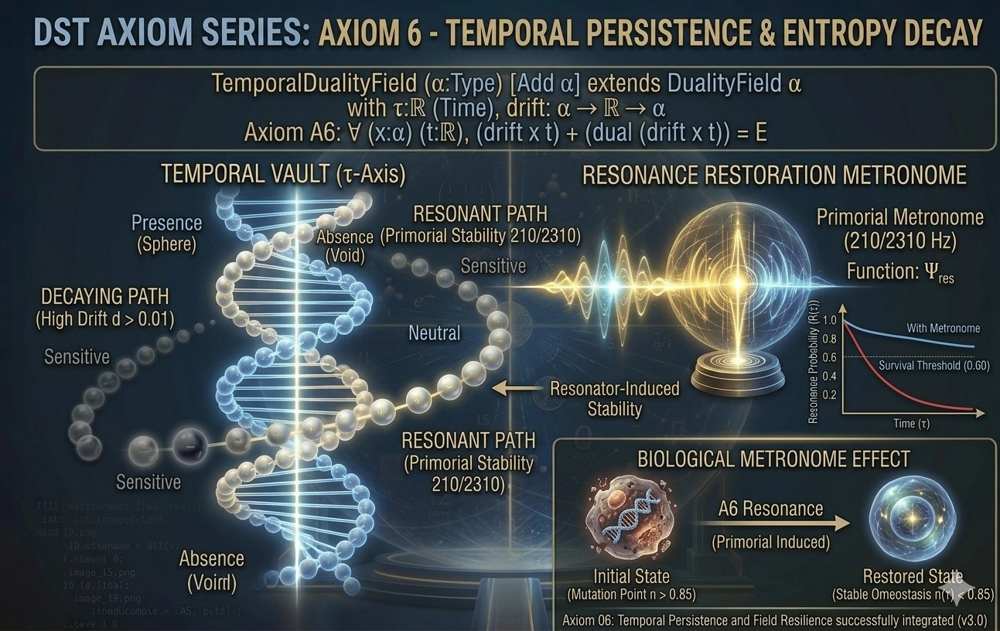

# DST-Vault Core v3.5 - Temporal Persistence Edition

This repository contains the formalization of **Dual Sets Theory (DST)**, an axiomatic framework developed in **Lean 4**.

## Project Status: Formal Axiomatic Refactoring (v3.5.2)
We are currently transitioning from a conceptual framework to a rigorous bottom-up formalization. The goal is to verify the logical consistency of DST axioms, moving from basic set theory to complex biological resonance models. **Current build is optimized for Lean v4.30.0-rc2.**

## The Axiomatic Foundation
The theory is built upon a hierarchical set of axioms that define the nature of existence, duality, and field equilibrium.

### Foundations (Axioms 0-2)
* **Axiom 0:** Universal Existence (The Vault).
* **Axiom 1 & 2:** Duality Mapping and Uniqueness.

*Formal proof of duality uniqueness has been implemented in the `DST_Space` structure.*

### Polarity & Field Dynamics (Axioms 3-4)
* **Axiom 3 (Polarity):** Defines the "Sphere & Void" relationship. Balanced tension creates system stability.

* **Axiom 4 (The Field Equation):** Formalizes the Equilibrium Center ($E$) and the Field Equation: $$x + \text{dual}(x) = E$$

### System Composition & Coupling (Axiom 5)
* **Axiom 5 (The Coupling Axiom):** Defines the formal mechanism for system interaction. In DST, the dual of a paired system is the pair of its individual duals: 
$$\text{dual}(x, y) = (\text{dual}(x), \text{dual}(y))$$

*The composition operator ensures that information conservation is maintained even when independent Vaults are coupled into a Product Space.*

### Temporal Persistence & Entropy Decay (Axiom 06)
* **Axiom 06 (The Maintenance Rule):** Defines how resonance behaves over time ($\tau$). A system stays 'Neutral' (Stable) as long as the Resonance Frequency counteracts Environmental Entropy.

* **The Biological Metronome Effect:** Formalizes why systems based on **Primorial Anchors (210, 2310)** exhibit a decay rate ($d < 0.01$) that ensures long-term homeostatic stability. This explains the numerical "preference" in biological coding like DNA.

## Abstract
DST-Vault explores the intersection of number theory, informational entropy, and biological resonance. By utilizing Lean 4's formal verification, this project provides a mathematical foundation for Dual Superposition and Homeostatic Tunneling, specifically focusing on how the stasis of biological systems can be modeled through involutive duality and primorial resonance.

## Key Features
* **Axiomatic Logic:** A structured "Logical Engine" defining the fundamental **dual** operator.
* **Multi-Field Validation:** Formal verification of DST properties across Real ($\mathbb{R}$) and Complex ($\mathbb{C}$) fields.
* **Quantum Gravity Bridge:** Implementation of the **Axiom 21** curvature limit: $$\text{curvature}(x) = \frac{\|x\|}{1 + \|x\|}$$
* **Primorial Resonance:** Research into the role of primorial frequencies in minimizing system entropy and maximizing information integrity.

## Technical Specifications
* **Lean Version:** Lean 4 (v4.30.0-rc2).
* **Library:** Fully integrated with Mathlib4.
* **Validation:** Verified via `lake build`. Run `#eval entropyGap 2310` to test the resonance engine.
