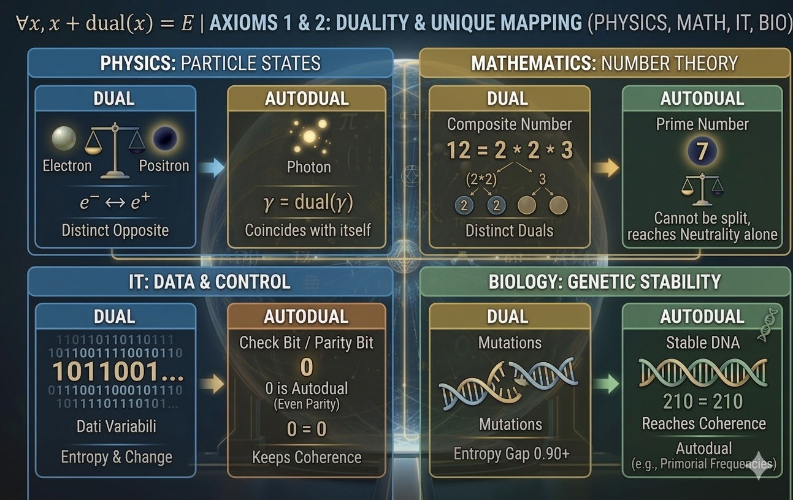

# DST-Vault Core v3.0 - Quantum Resonance Edition

This repository contains the formalization of **Dual Sets Theory (DST)**, an axiomatic framework developed in **Lean 4**.

## Project Status: Formal Axiomatic Refactoring (WIP)
We are currently transitioning from a conceptual framework to a rigorous bottom-up formalization. The goal is to verify the logical consistency of DST axioms, moving from basic set theory to complex biological resonance models.

## The Axiomatic Foundation
The theory is built upon a hierarchical set of axioms that define the nature of existence, duality, and field equilibrium.

### Foundations (Axioms 0-2)
* **Axiom 0:** Universal Existence (The Vault).
* **Axiom 1 & 2:** Duality Mapping and Uniqueness.

*Formal proof of duality uniqueness has been implemented in the `DST_Space` structure.*

### Universal Comparisons
DST applies across multiple domains, from particle physics to number theory.

### Polarity & Field Dynamics (Axioms 3-4)
* **Axiom 3 (Polarity):** Defines the "Sphere & Void" relationship. Balanced tension creates system stability.

* **Axiom 4 (The Field Equation):** Formalizes the Equilibrium Center ($E$) and the Field Equation: $$x + \text{dual}(x) = E$$

## Abstract
DST-Vault explores the intersection of number theory, informational entropy, and biological resonance. By utilizing Lean 4's formal verification, this project provides a mathematical foundation for Dual Superposition and Homeostatic Tunneling, specifically focusing on how the stability of biological systems like DNA can be modeled through involutive duality.

## Key Features
* **Axiomatic Logic:** A structured "Logical Engine" defining the universe (Vault) and the fundamental **dual** operator.
* **Formal Verification:** Proven theorems regarding the uniqueness of dual elements and geometric symmetry of the field.
* **Bio-Stability Models:** Research into the role of primorial frequencies (e.g., 210, 2310) in minimizing system entropy.

## Technical Specifications
* **Lean Version:** Lean 4 (current stable Mathlib compatible).
* **Build:** `lake build`
