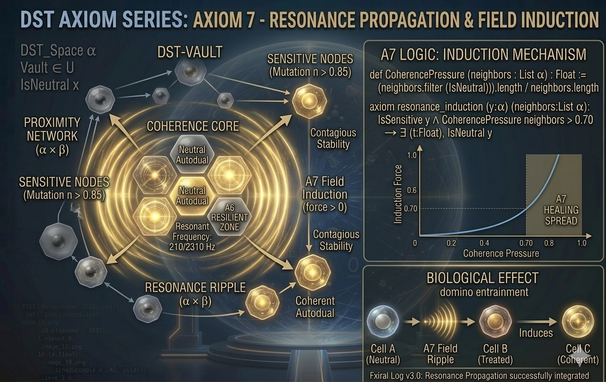

# DST-Vault Core v4.0 - Global Induction Edition

This repository contains the formalization of **Dual Sets Theory (DST)**, an axiomatic framework developed in **Lean 4**.

## Project Status: Global Resonance Integration (v4.0.0)
We have successfully implemented the final stage of the DST logic. With the addition of **Axiom 7**, the framework now accounts for spatial propagation and the "Healing Ripple" effect, moving from static duality to dynamic field induction.

## The Axiomatic Foundation
The theory is built upon a hierarchical set of axioms that define the nature of existence, duality, and field equilibrium.

### Foundations & Field Dynamics (Axioms 0-5)
* **Axiom 0-2:** Universal Existence and Duality Uniqueness.
* **Axiom 3-4:** Polarity (Sphere & Void) and the Field Equilibrium Equation: $x + \text{dual}(x) = E$.
* **Axiom 5:** System Composition & Coupling (Product Spaces).

### Temporal Persistence & Hierarchy (Axioms 6)
* **Axiom 6 (Temporal Maintenance):** Defines how resonance behaves over time ($\tau$).
* **Biological Metronome:** Formalizes why systems based on **Primorial Anchors (210, 2310)** exhibit minimal entropy decay.

### Global Resonance & Field Induction (Axiom 7) - **NEW**
* **Axiom 7 (Induction Law):** Formalizes the "Ripple Effect". Stability is not just local; it is contagious.

**A7 Logic: The Healing Spread**
When the **Coherence Pressure** (the ratio of Neutral/Stable neighbors) exceeds the critical threshold of **0.70**, a "Sensitive" node undergoes a phase transition to "Neutral".
* **Formula:** $\text{CoherencePressure} = \frac{\sum \text{Neutral Neighbors}}{\text{Total Neighbors}} > 0.70 \implies \text{Stability Induction}$.
* **Impact:** This explains the "Domino Entrainment" in biological tissues and the corrective behavior of the DST-Vault Engine when processing high-entropy numerical anomalies (like the 931Q "Flash Crash").

## Abstract
DST-Vault explores the intersection of number theory, informational entropy, and biological resonance. By utilizing Lean 4's formal verification, this project provides a mathematical foundation for how stable systems (Neutral Autoduals) exert pressure on their environment to minimize total entropy.

## Key Features
* **Axiomatic Logic:** Complete framework from A0 to A7.
* **Formal Verification:** Compiled and validated in Lean 4 with Mathlib4.
* **Predictive Analysis:** The "Vault Engine" now simulates resonance propagation across complex networks.
* **Primorial Anchors:** Integrated support for 210, 2310, and higher-order primorial resonance points.

## Technical Specifications
* **Lean Version:** Lean 4 (v4.30.0-rc2).
* **Environment:** Fully compatible with Mathlib4.
* **Build:** `lake build`

---
Copyright (c) 2026 Francesco Panascì (Italy)